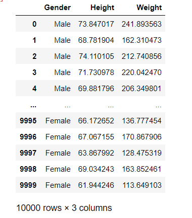
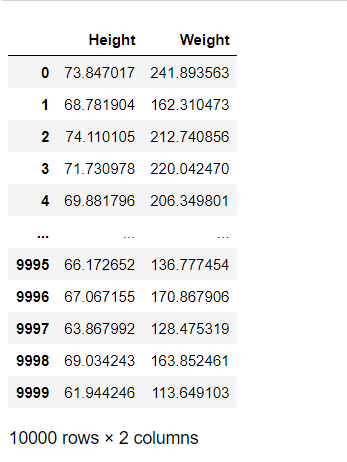
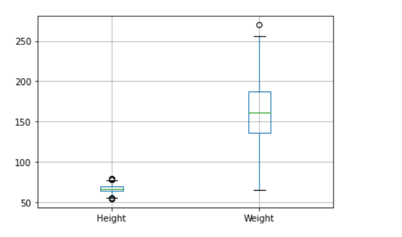
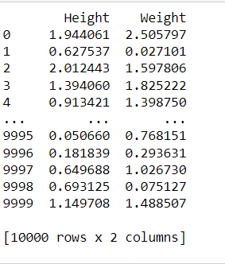
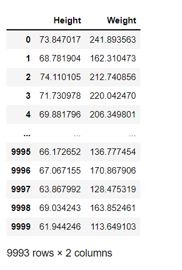
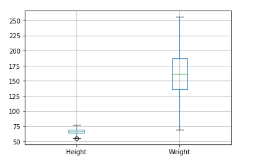
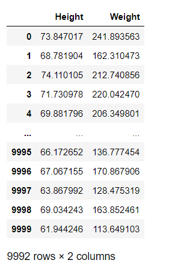
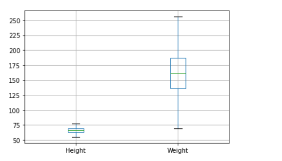
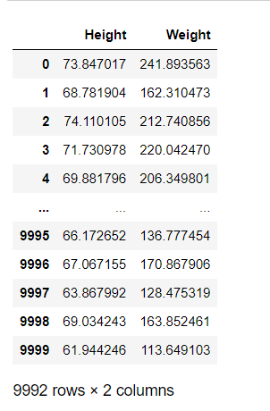

# Ex-02_DS_Outlier
# AIM:
To detect and remove the outliers in the given data set and save the final data.
# EXPLANATION:
Outlier is a data object that deviates significantly from the rest of the data objects and behaves in a different manner. They can be caused by measurement or execution errors. The analysis of outlier data is referred to as outlier analysis or outlier mining. The box plot is a useful graphical display for describing the behavior of the data in the middle as well as at the ends of the distributions. The box plot uses the median and the lower and upper quartiles (defined as the 25th and 75th percentiles). If the lower quartile is Q1 and the upper quartile is Q3, then the difference (Q3 - Q1) is called the interquartile range or IQ.
# ALGORITHM:
## STEP 1
Import the required packages(pandas,numpy,scipy)
## STEP 2
Read the given csv file
## STEP 3
Convert the file into a dataframe and get information of the data.
## STEP 4
Remove the non numerical data columns using drop() method.
## STEP 5
Detect the outliers in the data set using z scores method.
## STEP 6
Remove the outliers by z scores and list manupilation or by using Interquartile Range(IQR)
## STEP 7
Check if the outliersare removed from data set using graphical methods.
## STEP 8
Save the final data set into the file.
# PROGRAM:
~~~
PROGRAM DEVELOPED BY : K.BALAJI
REGISTER NUMBER : 212221230011

import pandas as pd
df=pd.read_csv('weight.csv')
df
df=df.drop("Gender",axis=1)
df
df.boxplot()
import numpy as np
from scipy import stats
z=np.abs(stats.zscore(df))
print(z)
df1=df.copy()
df1=df1[(z<3).all(axis=1)]
df1
df1.boxplot()
df2=df.copy()
q1=df2.quantile(0.25)
q3=df2.quantile(0.75)
IQR=q3-q1
df_new=df2[((df2>=q1-1.5*IQR)&(df2<=q3+1.5*IQR)).all(axis=1)]
df_new
df_new.boxplot()
df_new
df.to_csv('weight.csv', index=False)
~~~
# OUTPUT:
## Initial data set:

## Data set displaying after removing non numerical sets:

## Graph of initial data set with outliers:

## Zscores to detect outliers:

## Data set after removing outliers in weight using z scores and list manupilation:

## Graph after removing outliers in weight:

## Data set after removing outliers in height using Interquartile Range(IQR):

## Final graph :

## Final data set:

# RESULT:
Thus the outliers are detected and removed in the given file and the final data set is saved into the file.